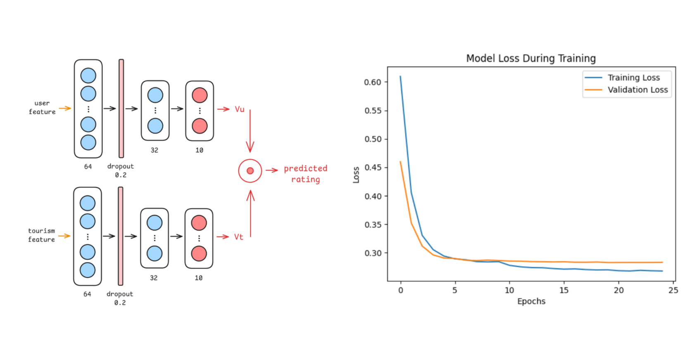
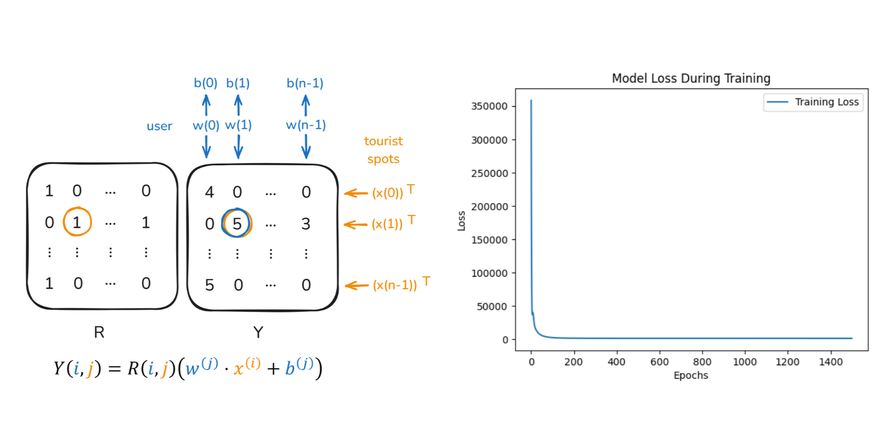
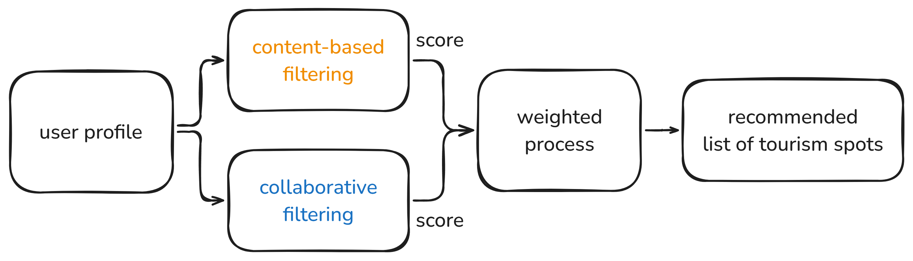

# Exploria Machine Learning Repository

Exploria is a project designed to enhance travel experiences while promoting sustainable tourism in Indonesia. By leveraging advanced technologies like AI and machine learning, this system provides smart recommendations tailored to individual preferences, helping travelers explore Indonesia responsibly and meaningfully.

## Why Exploria?

Indonesia is striving to become one of the world's top 10 global tourism destinations by 2045. This ambition is supported by remarkable growth in the tourism sector. According to the latest data from BPS-Statistics Indonesia, the country welcomed over 10 million foreign visitors by September 2024, a 20.28% increase from the same period in 2023. This steady rise reflects Indonesia's rich cultural and natural attractions, along with continuous improvements in tourism infrastructure.

In 2023 alone, Indonesia recorded 14.5 million international arrivals, up from 10.4 million in 2022. Tourism contributed significantly to the national economy, accounting for 5.5% of GDP. However, such rapid growth presents challenges, particularly in ensuring that development does not compromise the environment or cultural heritage. The increasing popularity of destinations demands solutions that balance economic gains with sustainability and preservation.

Exploria is our answer to this challenge. By promoting eco-friendly, culturally respectful tourism, it aligns with Indonesia's vision for responsible and sustainable travel, ensuring future generations can enjoy the country's natural and cultural wonders.

## Our Goals

Exploria is designed to:
- Provide personalized travel recommendations to match individual preferences.
- Promote sustainable tourism practices to protect Indonesia's environment and cultural assets.
- Encourage responsible travel choices that create meaningful experiences for visitors while preserving the country's unique heritage.

## Table of Contents
  - [Installation](#installation)
  - [Datasets](#datasets)
  - [Library](#library)
  - [Model](#model)
  - [About the Team](#about-the-team)

## Installation

Here's the installation guide to help you set up and run the Exploria Machine Learning project on your local machine:

1. Clone this repository to your local machine:
   ```bash
   git clone https://github.com/Exploria-Team/exploria-machine-learning.git
   ```

2. Once inside the root directory of this project, create a virtual environment (e.g. with the name `.venv`) to install all the dependencies needed to run all the code and notebooks:
   ```commandline
   python -m venv .venv
   ```

3. Activate the `.venv` virtual environment by running the following command:
   ```commandline
   .venv\Scripts\activate
   ```

4. After the virtual environment is active, install the project dependencies by running the following command:
   ```commandline
   pip install -r requirements.txt
   ```

You can ignore steps 2 and 3 if you don't want to use a virtual environment. Once the installation is complete, you can begin training, testing, or use the models.

---

Next is an explanation of various important details, including the structure and outcomes of this machine learning project.

## Datasets

The datasets used in this project are essential for the functionality of the application, training the machine learning models, and generating personalized travel recommendations. All datasets are organized within the `Dataset` directory. Below is a detailed list of the datasets included in the project:

1. **Tour_Guide_Biografi_with_Links_New.csv**  
   A CSV file containing detailed biographical data about tour guides, along with links to additional resources or online profiles.

2. **new_tourism_rating_comments.csv**
   This file contains detailed ratings and comments for various tourism spots provided by registered users.

3. **new_tourism_with_id_links_3.csv**  
   This dataset contains information about tourism spots, including unique IDs and links for further reference.

4. **old_users_data_with_links.csv**  
   A dataset containing existing user data already registered within the application.

5. **package_tourism.csv**  
   A dataset listing available tourism packages, including descriptions, pricing, and additional details.

6. **tourist_spots_distance.csv**  
   This file includes the distances between various tourist spots. It is used in optimizing itineraries for users, ensuring that the suggested travel routes are efficient and practical.

## Library

In this project, we rely on several libraries to handle data processing, model building, and evaluation. Below are some of the core libraries used:

- **Pandas**: For data manipulation and preprocessing.
- **NumPy**: For numerical computing and handling arrays.
- **Scikit-Learn**: For data preprocessing.
- **TensorFlow**: For building and training machine learning models.
- **Matplotlib**: For visualizations and result plotting.
- **Seaborn**: For visualizations and result plotting.

The list of libraries and their versions can be found in the `requirements.txt` file. 

## Model

The recommendation system combines collaborative filtering and content-based filtering to create a hybrid recommendation approach. All models are stored in the `Model` folder and can be trained using the corresponding notebooks. The trained models are saved as `.h5` files, ready for inference. Examples of how to use the models can be found in the `Example` directory. Below is a detailed list of the models included in the project:

**Content-Based Filtering**  
 - **Training**: `Model/Content_Based.ipynb`  
 - **Model**: `Model/content_based.h5`  
 - **Example**: `Example/content_based.ipynb`  
 - The recommendation system suggests destinations by analyzing item attributes and user preferences. It utilizes two primary inputs for training and prediction: user features, which are represented by the average ratings the user has given across different tourism categories, and tourist spot features, which are derived from various attributes and metadata of the tourist spots. This combination allows the model to effectively match user preferences with suitable destinations. The training process is optimized using the Mean Absolute Percentage Error (MAPE) as the primary cost metric, ensuring precise error measurement relative to the scale of the data. The results of the training demonstrated substantial cost reduction, highlighting the model's ability to effectively learn patterns and make accurate predictions. This approach ensures the system delivers reliable, data-driven recommendations tailored to the user’s interests.

   <div align="left">
      
   </div>

**Collaborative Filtering**  
 - **Training**: `Model/Collaborative_Filtering.ipynb`  
 - **Model**: `Model/collaborative_filtering.h5`
 - **Example**: `Example/collaborative_filtering.ipynb`
 - The recommendation system leverages user-item interactions (ratings) to suggest destinations based on similarities among users. The model uses all available user ratings as input to collaboratively train a system that identifies user feature values and tourist spot feature values. These feature values are optimized to meet user preferences while aligning with the ratings of all tourist spots in the dataset. The training process employs a custom cost function tailored specifically for collaborative filtering, ensuring accurate prediction of user ratings. This approach effectively captures latent patterns in user behavior and item attributes. The training results showed significant cost reduction, indicating effective model optimization.

   <div align="left">
      
   </div>

**Hybrid Recommendation**
 - **Class**: `Model/hybrid_recommendation.py`
 - **Example**: `Example/hybrid_recommendation.ipynb`
 - The Python implementation class integrates collaborative and content-based models to deliver highly personalized recommendations. The hybrid approach is achieved by assigning weighted contributions to the outputs of the content-based filtering and collaborative filtering models. This weighted combination allows the system to leverage the strengths of both methods: content-based filtering excels in recommending items with similar attributes to the user's preferences, while collaborative filtering identifies patterns from user interactions and ratings. By balancing these two techniques, the hybrid model ensures a more accurate and user-centric recommendation experience.

   <div align="left">
      
   </div>

## About the Team

Exploria's Machine Learning team consists of passionate individuals from Bangkit 2024 Batch 2:
| **Name**                | **Bangkit ID**       | **Path**           |
|--------------------------|----------------------|--------------------|
| Komang Ryandhi Suandita | M004B4KY2222    | Machine Learning   |
| Bayu Siddhi Mukti        | M004B4KY0830      | Machine Learning   |
| Yasmin Nur Helisa       | M004B4KX4522     | Machine Learning   |

Explore responsibly. Travel meaningfully. With Exploria.
